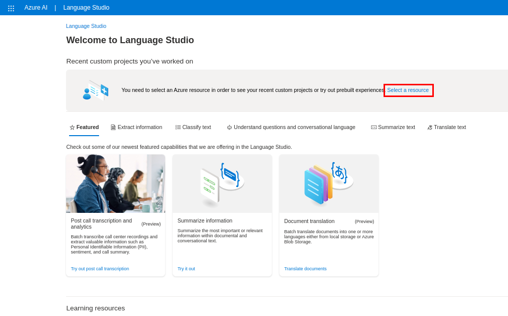
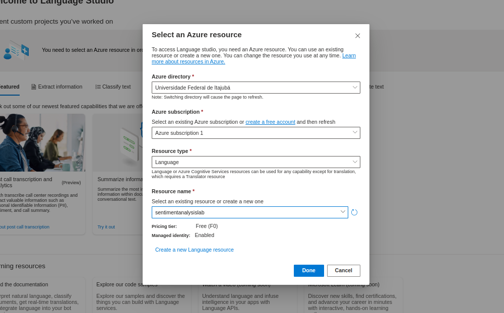

# Lab Project 03 - Análise de sentimentos com Language Studio no Azure AI
**Sentiment and opinion mining** é uma solução da plataforma **Language Studio, da Azure**, que permite **detectar sentimentos positivos, negativos e neutros** a partir de sentenças. Esse repositório mostra alguns exemplos de testes na plataforma. Os procedimentos foram realizados como parte do **Bootcamp Microsoft Azure AI Fundamentals, da DIO**.

-green)

-blue)

## Índice
1. [Procedimento](#procedimento)
2. [Resultados](#resultados)
3. [Conclusão e Insights](#conclusão-e-insights)

## Procedimento
Esses experimentos foram baseados nos guias da Microsoft Learn. Para informações mais detalhadas, consulte a página [Analyze text with Language Studio](https://microsoftlearning.github.io/mslearn-ai-fundamentals/Instructions/Labs/06-text-analysis.html).

### Criar um recurso Azure Language Service
Para ser possível usar o Language Studio, é essencial que você possua um recurso para a plataforma associado a sua conta Azure. Isso pode ser feito por meio dos seguintes passos:
1. Acessar https://portal.azure.com
2. Criar um novo recurso **Language Service** através da opção Create Resource.

    

    

3. Esperar o *deploy* do recurso terminar.

### Selecionar recurso no Language Studio
Com o recurso Language Service criado, é preciso conecta-lo ao Language Studio. Para isso, basta seguir os seguintes passos:

1. Acessar o [Language Studio](https://language.cognitive.azure.com/home).
2. Na página inicial, acessar os recursos criados através do botão "Select a resouce".

    

3. Preencha as informações e selecione o recurso recém criado.

    

### Selecionando e testando o serviço no Language Studio
Ao retornar a página inicial após concluídos os passos anteriores, é possível ver a lista de serviços disponíveis para teste na plataforma. Nesse experimento foi usado o serviço "Analyze sentiment and mine opinions", na aba "Classify text".

    

## Resultados
Ao acessar o serviço é possível carregar o texto a ser analisado, selecionar sua linguagem e também ativar a opção de opinion mining. Para esse experimento, selecionei um capítulo do livro de Mateus, da Bíblia. 

    

Abaixo podemos ver o resultado da análise de sentimento de todo o texto. De acordo com os resultados, o texto é majoritariamente negativo (65%). Contudo, a confiança do resultado informado é de apenas 25%. É interesante notar que algumas sentenças obtiveram boa taxa de *confidence*, enquanto outras foram consideradas 100% negativas com 0% de confiança.

    

 

    

 

    

Abaixo é possível observar a funcionalidade de *opinion mining* funcionando:

    

## Conclusão e Insights
Ferramentas de análise de sentimentos e opiniões podem ser muito úteis na automação de análises de *feedbacks* para serviços. Apesar desse recurso funcionar muito bem para textos que claramente visam expressar sentimentos, como é o caso de comentários e avaliações de produtos, a ferramenta não parece se sair tão bem em textos onde essa expressão não é tão clara. Acredito que esse resultado se deve ao fato de que a ferramenta analisa apenas uma sentença por vez e não parece levar em consideração todo o contexto. Penso que uma tecnologia capaz de estabelecer conexões entre sentenças e obter um entendimento geral sobre o contexto de todo o texto possivelmente seria mais bem sucedida nessa análise. 
